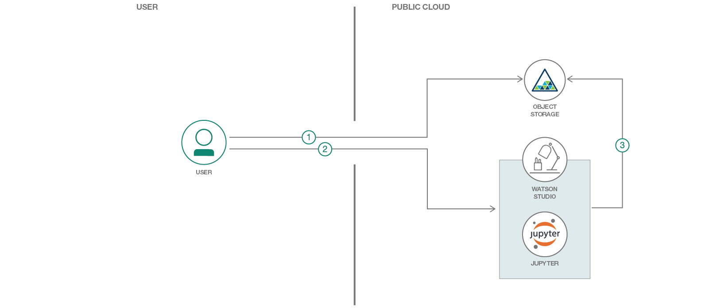
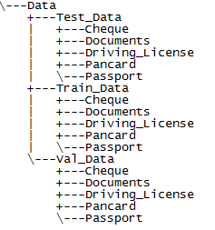
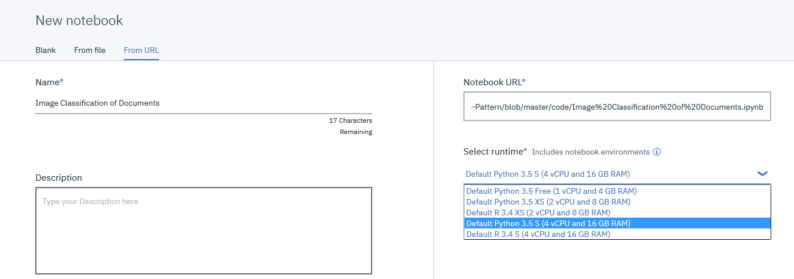
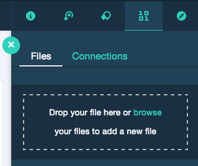
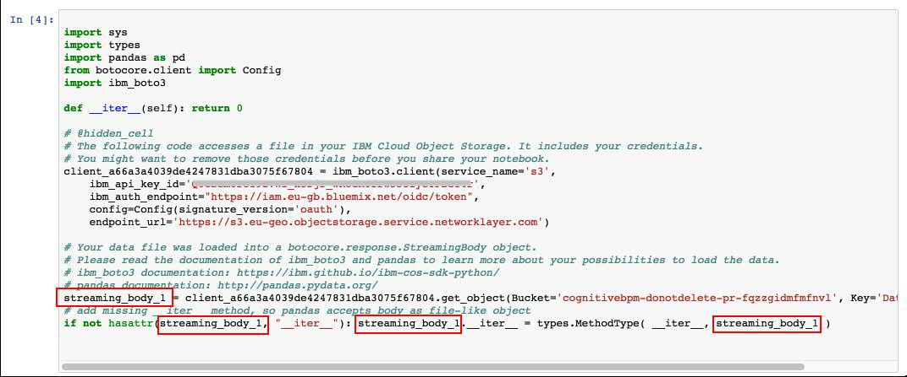

# image-classification-using-cnn-and-keras
**WORK IN PROGRESS**: This code pattern showcases capability of classifying images, specifically document images like ID cards, application forms, cheque leaf, using CNN in Keras libraries.


# Image Recognition and Information Extraction from Image Documents using Keras and Watson NLU  

This code pattern demonstrates how images, specifically document images like id cards, application forms, cheque leaf, can be classified using Convolutional Neural Network (CNN). Even though there are code patterns for image classification, none of them showcase how to use CNN to classify images using Keras libraries.

Many organisations process application forms, such as loan applications, from it's customers. Along with the application forms, customers provide supporting documents needed for processing applications. Some of these supporting documents could be identity proof document, address proof document. Generally application forms, along with supporting documents, are scanned and captured into the organisation's systems for further processing of applications. When the system is fed with a set of all these scanned documents, it needs to identify the form document so that it can process it further. This code pattern shows how to classify images and identify application form document among them.

What is CNN and why CNN?
A CNN is a supervised learning technique which needs both input data and target output data to be supplied. These are classified by using their labels in order to provide a learned model for future data analysis.

Typically a CNN has three main constituents - a Convolutional Layer, a Pooling Layer and a Fully connected Dense Network. The Convolutional layer takes the input image and applies m number of nxn filters to receive a feature map. The feature map is next fed into the max pool layer which is essentially used for dimensionality reduction, it picks only the best features from the feature map. Finally, all the features are flattened and sent as input to the fully connected dense neural network which learns the weights using backpropagation and provides the classification output.

The motivation behind the CNN is that it is based on the way the visual cortex functions, where one object in the scene is in focus while the rest is blurred, similarly the CNN takes one section/window of the input image at a time for classification. Each time the CNN will produce a feature map for each section, in the convolutional layer. In the Pooling layer it removes the excess features and takes only the most important features for that section, thereby performing feature extraction.  Hence, with the use of CNNs we don't have to perform an additional feature extraction technique.

CNNs require lesser pre-processing as compared to other similar classification algorithms. While traditional MLP(Multi Layer Perceptron) algorithms have significant accuracy for image recognition, they suffer from the curse of dimensionality due to the nodes being fully connected, and hence cannot be scaled to high resolution images.
CNNs overcome these challenges posed by MLP by exploiting the spatial correlation of an image. This is done by enforcing a pattern of local connectivity between adjacent neuron layers. Hence, CNNs prove to be superior at Image classification, Video Analysis, Natural Language Processing and wide range of other applications as compared to other techniques.


This code pattern covers the following aspects:
* Dataset preparation for training and testing
* Running notebook for image classification


In this code pattern, we have considered applications for `Purchase Agreement` and `Rental Agreement`. Typical documents that are submitted for these applications are PAN (Permanent Account Number) card, Driving License, Cheque leaf, Passport and the application form itself. This code pattern identifies the application form document from all the other types of documents.

We will use Python, Jupyter notebook, CNN in Keras libraries and IBM Cloud Object Storage


## Flow

1. User uploads test images to IBM Cloud Storage.
2. User adds Cloud Object Storage credentials, in Jupyter notebook, for the test images uploaded. User runs the notebook.
3. Notebook pulls images from Cloud Object Storage and classifies the images using trained machine learning model.


## Included components

* [IBM Watson Studio](https://console.bluemix.net/catalog/services/watson-studio): Analyze data using RStudio, Jupyter, and Python in a configured, collaborative environment that includes IBM value-adds, such as managed Spark.

* [IBM Cloud Object Storage](https://console.bluemix.net/catalog/infrastructure/cloud-object-storage): An IBM Cloud service that provides an unstructured cloud data store to build and deliver cost effective apps and services with high reliability and fast speed to market.

## Featured technologies

* [Jupyter Notebooks](http://jupyter.org/): An open-source web application that allows you to create and share documents that contain live code, equations, visualizations and explanatory text.
* [Artificial Intelligence](https://www.computerworld.com/article/2906336/emerging-technology/what-is-artificial-intelligence.html): Intelligence demonstrated by machines, in contrast to the natural intelligence displayed by humans.
* [Machine Learning](https://searchenterpriseai.techtarget.com/definition/machine-learning-ML): Uses statistical techniques to give computer systems the ability to "learn" with data
* [Python](https://www.python.org/): An interpreted high-level programming language for general-purpose programming


# Steps
Follow these steps to setup and run this code pattern. The steps are described in detail below.
1. [Sign up for IBM Watson Studio](#1-sign-up-for-ibm-watson-studio)
2. [Classification of image Documents](#2-classification-of-image-documents)
5. [Analyze the Results](#5-analyze-the-results)


## 1. Sign up for IBM Watson Studio

If you have not already signed up for Watson Studio then you can sign up [here](https://console.bluemix.net/catalog/services/watson-studio). By signing up for IBM Watson Studio, two services will be created - ``Spark`` and ``ObjectStore`` in your IBM Cloud account.


## 2. Building Machine Learning Model

### 2.1 Data preparation

Training a machine learning model requires a large number of documents and variety in them. While we have trained and tested the methodology followed in this code pattern, which has given good accuracy (>85%) with a large dataset, we cannot provide those images since they are not publicly available images. For the sake of executing this code pattern and understanding the methodology we have provided our personal documents and masked personal information on those documents. Please note that multiple copies, with resolution and color changes, of same kind of documents are provided. It is recommended that the user create their own set of images and use them in this code pattern so that they can appreciate the real value of this code pattern.
<TODO prepare dataset with some tilted images and test>
To create your own dataset, follow the following naming structure for each type of image -



You can use the dataset provided in this code pattern or create your own dataset. To use the dataset provided in this code pattern, download the ``Data.zip`` file from Data folder of [this repository](https://github.com/IBM/image-recognition-and-information-extraction-from-image-documents)

#### To create your own dataset
Create a folder named `Data`. Then create three sub-folders named `Train_Data`, `Test_Data`, `Val_Data` which are used for training, testing and validation respectively. Since we have used Cheque, Form Documents, Driving License, Pancard and Passport create folders to indicate the types of documents `Cheque`,`Documents`,`Driving_License`,`Pancard`,`Passport` which will be the classes that machine learning model learns and classifies images.

Compress the `Data` folder so it can be uploaded to Object Storage.

If you are using a mac machine then compression creates some additional files which should be deleted. On command prompt, go to the compressed file location and run the following commands:
```
* zip -d Data.zip \__MACOSX/\\*
* zip -d Data.zip \\\*/.DS_Store
```


### 2.4 Create Object Storage service instance
[Create an Object Storage instance](https://console.bluemix.net/catalog/services/cloud-object-storage), if you do not have an instance created earlier.

### 2.4 Create notebook

A [notebook](https://datascience.ibm.com/docs/content/analyze-data/notebooks-parent.html) in Watson Studio is a web-based environment for interactive computing. You can run small pieces of code that process your data, and you can immediately view the results of your computation.

Login to [IBM Cloud Dashboard](http://console.bluemix.net/). Click on the Watson Studio instance that was created earlier. Click `Get Started` button at the bottom of the page.

* If a project is not created earlier then click `New Project`. Provide any Name. Object Storage instance should already be selected by default. Verify it is the instance that you want to use. If not select the instance you want from drop down list
* Click on `Assets` tab. Navigate to `Notebooks` section below. Click `Create Notebook`
* Select the `From URL` tab.
* Enter a name for the notebook.
* Optionally, enter a description for the notebook.
* Enter this Notebook URL: https://github.com/IBM/image-recognition-and-information-extraction-from-image-documents/blob/master/notebooks/Image%20Classification%20of%20Documents.ipynb<TODO update this URL>
* Under Runtime select Default Python with 4 CPU and 16GB RAM
* Click the `Create` button.



### 2.5 Add data files

* Add `Data.zip` file, created/downloaded in [this section](#21-data-preparation), to Object Storage. In Watson Studio, go to your project default page, use `Find and Add Data` (look for the 10/01 icon) and its `Files` tab
* Click browse and upload `Data.zip` file



If you use your own dataset, you will need to update the variables/folder names that refer to the data files in the Jupyter Notebook.

To open the notebook, click on the edit icon to start editing the notebook on your project.

In the notebook, update the global variables in the cell following

2.2 Global Variables section.

In the notebook, update the global variables in the cell following 2.2 Global Variables section.
Enter the desired batch_sizes for your training, validation and testing datasets

`interested_folder='Documents'` is used to specify which class is to be treated as application forms class, so that it points out images that belong to this class.


### 2.6 Update notebook with service credentials

Add the Object Storage credentials to the notebook

Select the cell below 2.1 Add your service credentials for Object Storage section in the notebook to update the credentials for Object Store.

* Delete the contents of the cell
* Use `Find and Add Data` (look for the 10/01 icon) and its Files tab. You should see the file names uploaded earlier. Make sure your active cell is the empty one below 2.2 Add...
* Under Files, click the dropdown for `Insert to code` for `Data.zip`
* Click `Insert StreamingBody object`.

* Make sure the credentials are saved as streaming_body_1. If not edit and replace the numbers to 1. There should be four such occurrences in the cell as shown in the below image



### 2.7 Train model
Run the notebook until section <TODO> by clicking on the `run` button in Jupyter notebook menubar

Depending on the dataset, the training of the model takes about one hour. When all the cells in the notebook have run without any errors, we have our machine learning model trained. The trained model also classifies test images. It will point out to the test image that was of the type `Document` (application form document)


This notebook was able to identify the form document from a set of application documents.


## 3. Testing image classification machine learning model

### 3.1 Prepare data

Once the model is trained, it is ready to classify images. Place all images that need to be classified have to be in a folder. Compress the folder. It's named as `testdoc-external.zip` in this code pattern. You can supply your own set of images for classification or use the one provided in this code pattern.

If you are using a mac machine then compression creates some additional files which should be deleted. On command prompt, go to the compressed file location and run the following commands. Replace file name if you are using a different file name.
```
* zip -d test_doc-external.zip \__MACOSX/\\*
* zip -d test_doc-external.zip \\\*/.DS_Store
```


---------
Select the cell in Section 4.4

* Delete the contents of the cell
* Use `Find and Add Data` (look for the 10/01 icon) and its Files tab. You should see the file names uploaded earlier. Make sure your active cell is the empty one below 2.2 Add...
* Under Files, click the dropdown for `Insert to code` for `test_doc-external.zip`
* Click `Insert StreamingBody object`.
* Make sure the credentials are saved as streaming_body_2. If not edit and replace the numbers to 2. There should be four such occurrences in the cell as shown in below image


--------

## 5. Analyze the Results

This pattern aims to automate the identification of legal form document from other such documents and further extract useful information to classify the kind of legal form document it is.

1. First, we ran the notebook `Image Classification of Documnet.ipynb`. Here we created and trained an image classification machine learning model. We then provided the model with a set of images for it to classify. The model classified the images and marked the application for documents in the set of input images by providing it's path. e.g. `test_doc-external/Form1 copy 2.jpg`
2. As a second step we ran the second notebook `conv_img_to_txt.ipynb` while providing the application form document identified by first notebook. Here we converted image to text using tesseract and uploaded the file to Object storage
3. As a final step we ran the notebook `Entity Extraction and Document Classification.ipynb`. This notebook used a couple of configuration files and identified required information from the text extracted in the second step above. It used Watson NLU and custom configuration to understand what information to identify based on what type of document is the text document. like, if the text is a purchase agreement, then it identifies a particular set of entities related to purchase agreement.
